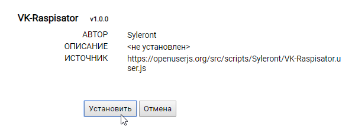
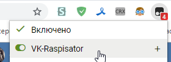
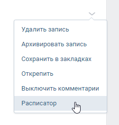
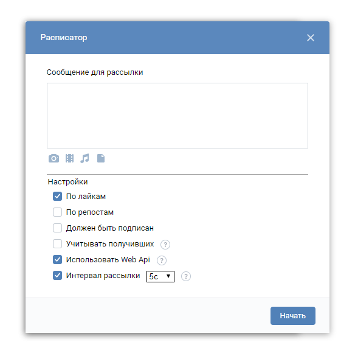
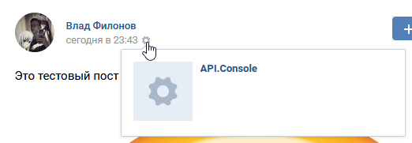
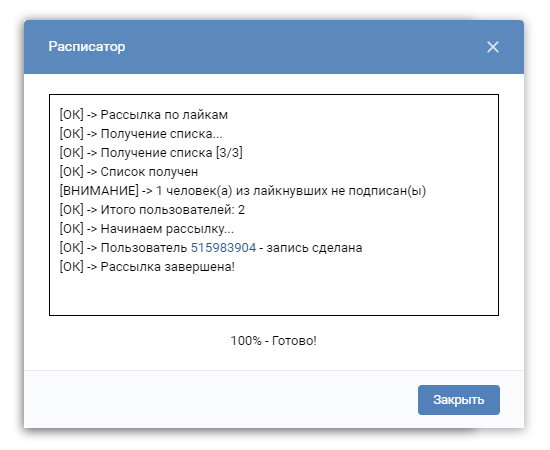

# ВК - Расписатор (да, кринж)
Приблуда, для тех людей, которые делают различные росписи на стены по репостам/лайкам. Сделана на чистом энтузиазме, специально для зайки [FeelBro](https://www.youtube.com/channel/UC3MTCmP6lcstqOXSOoazWuA) aka [Александр Харукевич](https://vk.com/id145563872), проведя несколько десятков часов в консоли и ковырянии ВК, написания кода и костылей.

## Установка
Устанавливаете **Tampermonkey** для своего браузера:
* [Chrome, Opera, Yandex, etc.](https://chrome.google.com/webstore/detail/tampermonkey/dhdgffkkebhmkfjojejmpbldmpobfkfo)
* [Firefox](https://addons.mozilla.org/ru/firefox/addon/tampermonkey/)

После чего переходите [сюда](https://openuserjs.org/src/scripts/Syleront/VK-Raspisator.user.js), и, если установлено расширение, появится окно установки, где тыкаете кнопку "**Установить**": 

После того как скрипт установлен, открываем (или обновляем) страницу с вк, и, если все нормально, то при нажатии на значок расширения, он покажет активные скрипты, и там должен быть наш: 

## Использование
Чтобы выбрать пост, по которому будет производится рассылка, достаточно найти нужный, и навести кнопку мыши на стрелку (справа от поста), где выбрать в выпадающем меню "**Расписатор**": 

После чего откроется основной бокс для рассылки: 

### Описание настроек
* По лайкам / По репостам - выбирается только один из пунктов. Определяет, по какому параметру будет производится роспись (думаю, это понятно).
* Должен быть подписан - проверяет, подписаны ли лайкнувшие/репостнувшие на паблик, если не подписаны - то пропускает их (с записями на страницах пользователей данный параметр не работает, учтите это).
* Учитывать получивших - каждый раз, когда скрипт делает рассылку, он сохраняет всех, кому был сделан пост. Если при следующем запуске рассылки этот параметр будет включен, то расписатор не будет рассылать посты тем, кто их уже получил с данной записи. Если же этот параметр выключен, и рассылка с данной записи со стены уже была проведена, то в таком случае список будет обнулен и создан заново.
* Использовать Web Api - когда делается пост, вк автоматически помечает его, через какое приложение он был создан (Android, IOS и т.д), в данном случае API.Console: 
 
Eсли данный параметр включен, то пост делается без пометки. Но, так как для него используется внутренний API вконтакте, то нет никаких гарантий по его бесперебойной работе. Однако, несмотря на это, рекомендуется оставлять включенным, ибо шанс, что он выйдет из строя не велик.

### Процесс рассылки
После того как мы написали нужный нам текст, прикрепили нужные файлы, и настроили параметры, нажимаем кнопку "**Начать**", после чего запустится процесс рассылки, и откроется бокс с логом: 
 
Лучше всего будет следить за тем, что там происходит, на наличие каких-либо ошибок. Если по какой-то причине вылезла ошибка, то скрипт не сохранит пользователя, как получившего роспись, и в следующий раз попробует сделать пост снова. Если вылезло что-то непонятное, то рекомендуется прислать скриншот ошибки мне в [ЛС](http://vk.me/syleront).

### FAQ:
**Q**: В логе появилась непонятная ошибка, что делать? 
**A**: Чаще всего, ошибка будет связана с API вконтакте, либо с его внутренними механизмами. При такой ошибке, в логе выводится её причина. Если вы ничего в этом не понимаете, то пришлите мне скриншот с ошибкой в [ЛС](http://vk.me/syleront).
  
**Q**: Что делать, если рассылка шла нормально, но в один момент в логе стали сыпаться ошибки? 
**A**: Скорее всего, вы превысили суточный лимит на создание постов в ВК. В таком случае прервите процесс рассылки, и попробуйте на следующий день, с включенным параметром "Учитывать получивших".
  
**Q**: Скрипт крадет мои личные данные? 
**A**: ~~Да, а также рассылает ваши голые фото всем друзьям.~~ **Во-первых**, до ваших фоток в толчке, личных переписок и т.д., мне нет никакого дела. **Во-вторых**, скрипт Open-Source, и все что он делает вы можете увидеть своими глазами. **В-третьих**, все запросы, которые он посылает, можно отследить в консоли, и, в добавок ко всему этому, на домены которые **не указаны** в Meta блоке юзерскрипта, он совершать запросы никак не может.